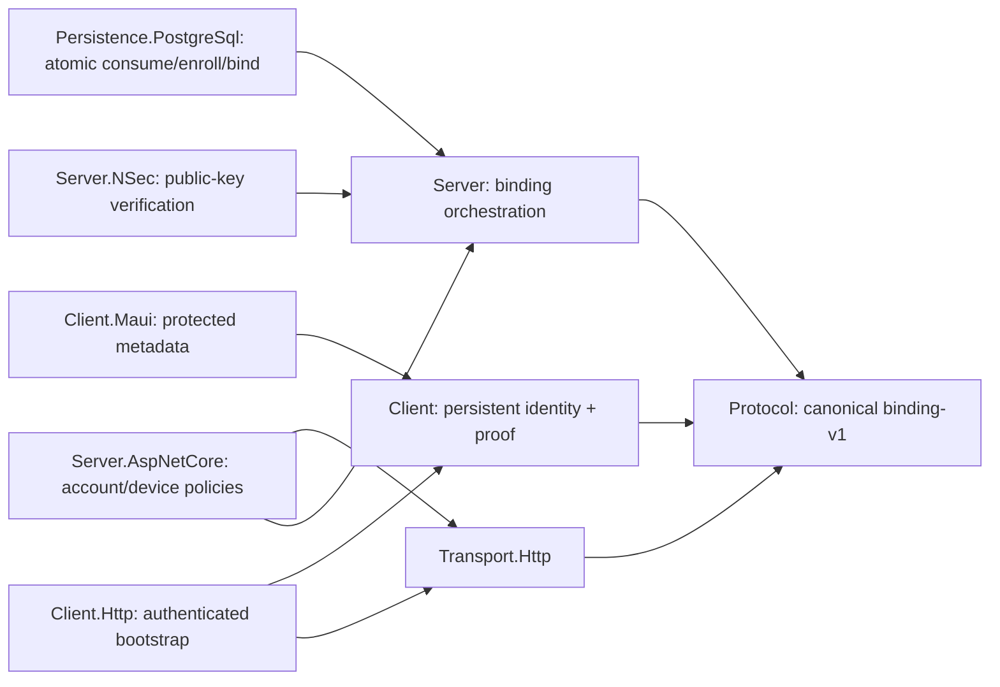

# Skopka.Chat

Skopka.Chat — переиспользуемый транспорт-независимый движок личного чата для .NET 10. Сервер регистрирует публичные данные устройств, хранит и доставляет зашифрованные конверты, но не получает закрытые ключи и не имеет API расшифровки.

> **Security status:** это ограниченный E2EE MVP, а не реализация Signal и не прошедший аудит production-протокол. В v1 нет Double Ratchet, forward secrecy относительно компрометации долгосрочного ключа получателя и post-compromise security. Перед использованием прочитайте [threat model](docs/threat-model.md), [ADR по криптографии](docs/adr/0001-e2ee-cryptography.md) и [ограничения MVP](docs/mvp-limitations.md).

## Пакеты

Версия `0.15.0` добавляет `Skopka.Chat.Client.Browser`: standalone Blazor WebAssembly, общий с native клиентский движок, локальная libsodium.js, зашифрованные IndexedDB identity/history/outbox и cookie/BFF-интеграция без OAuth-токенов в браузере. Старые NSec-ключи и серверные протоколы сохранены. Проверяются реальные Chromium и Firefox, включая взаимное E2EE с .NET, перезагрузки и конкурентные вкладки. Описание, ограничения и запускаемый пример — в [руководстве браузерного клиента](docs/browser.md).

В этот же релиз входят `Skopka.Chat.Bots`, `.Bots.Sqlite` и `.Bots.AspNetCore`: текстовый bot-runtime, долговечная очередь и приватный HTTP-шлюз у владельца бота. Основной сервер не расшифровывает сообщения. Подтверждение оператора, экран согласия и серверные правила доступа подключает приложение-хост; без них включать ботов нельзя. См. [интеграцию ботов](docs/bots.md). Согласованный набор — 23 пакета (20 core/bot + 1 browser + 2 MAUI).

- `Skopka.Chat.Protocol` — идентификаторы, лимиты, публичные контракты и каноническое бинарное представление v1; без ASP.NET Core, EF Core и криптографии клиента.
- `Skopka.Chat.Attachments` — transport-neutral контракт immutable ciphertext storage, авторизация upload/download/delete и общие лимиты; зависит только от Protocol.
- `Skopka.Chat.Attachments.PostgreSql` — отдельный `AttachmentDbContext`, migration и ограниченное `bytea`-хранилище для небольших зашифрованных файлов.
- `Skopka.Chat.Attachments.S3` — потоковое S3-compatible хранилище с conditional create, проверкой длины/SHA-256 и без перезаписи объекта.
- `Skopka.Chat.Client` — общий движок для native/browser: идентичность, `IDeviceKeyStore`, платформенная граница криптографии (по умолчанию NSec на native), typed content, fan-out, файлы, проекции, fingerprints и `IChatTransport`.
- `Skopka.Chat.Client.Browser` — browser-only криптография и защищённое локальное хранение, постоянная identity, durable очередь и same-origin cookie/CSRF адаптеры. Требуется отдельная локальная фраза разблокировки, не пароль аккаунта.
- `Skopka.Chat.Client.Storage` — durable journal contracts, восстановление проекций и `ChatSyncCoordinator` с порядком verify/decrypt → store → apply → acknowledge.
- `Skopka.Chat.Client.Storage.Sqlite` — локальный SQLite-журнал проверенных typed events с атомарной дедупликацией `MessageId`; хранит plaintext и требует host-защиты файла БД.
- `Skopka.Chat.Bots` — клиентский runtime текстовых ботов с проверкой host-owned согласия и раскрытия оператора.
- `Skopka.Chat.Bots.Sqlite` — долговечный inbox бота, acknowledgements и идемпотентность исходящих запросов; защита локальной БД остаётся у владельца.
- `Skopka.Chat.Bots.AspNetCore` — приватный HTTP-шлюз у владельца бота и защищённый Data Protection адаптер identity; не часть основного chat server.
- `Skopka.Chat.Client.Maui` — адаптеры MAUI `SecureStorage`, lifecycle/session coordination и ограниченная работа с временными plaintext-файлами; зависит от Client/Client.Storage/Media, но не от Server.
- `Skopka.Chat.Media` — client-side режимы `Auto`/`Media`/`File`, заменяемая подготовка фото/видео и orchestration prepare → encrypt → upload; без server/persistence/UI framework.
- `Skopka.Chat.Media.FFmpeg` — необязательное локальное JPEG/H.264/AAC преобразование через host-supplied FFmpeg; binary не входит в NuGet-пакет.
- `Skopka.Chat.UI.Core` — framework-independent `ChatViewModel`, composer/reply/reaction/forward/edit commands и host-owned `IChatContentSender`; без зависимости от Blazor, transport или server.
- `Skopka.Chat.UI.Blazor` — доступные Blazor-компоненты с CSS variables, локализуемыми строками и заменяемыми message/attachment/composer templates.
- `Skopka.Chat.UI.Maui` — виртуализированный нативный `CollectionView` с compiled bindings, стабильным diff, темами, templates и host callbacks для файлов/пересылки/paging.
- `Skopka.Chat.Transport.Http` — общие HTTP routes, JSON DTO, protocol mappings, лимиты и строгий source-generated `System.Text.Json` профиль; зависит только от Protocol.
- `Skopka.Chat.Client.Http` — typed `HttpClient`, `IAccessTokenProvider`, HTTPS-by-default, bounded responses, потоковая загрузка/расшифровка attachments и ограниченные retries идемпотентных операций; без ссылки на Server.
- `Skopka.Chat.Server` — личные диалоги, жизненный цикл устройств, идемпотентный приём, очередь доставки, acknowledgements и repository-интерфейсы; без ссылки на Client.
- `Skopka.Chat.Server.NSec` — optional Ed25519 verifier для device-binding proof через существующий NSec; без private keys/decryption API и без зависимости Server → Client.
- `Skopka.Chat.Server.AspNetCore` — необязательные Minimal API endpoints для envelopes и attachment ciphertext с обязательной авторизацией и строгой привязкой user/device claims; без выбора формата токена или identity provider.
- `Skopka.Chat.Persistence.PostgreSql` — EF Core 10/Npgsql, PostgreSQL migration, ограничения `bytea`, внешние ключи, индексы доставки и TTL cleanup.

Постоянная device identity и opt-in enrollment/rebind из `0.14.0` сохраняются: logout/re-login не меняет DeviceId, ключи и пути history/outbox. В `0.15.0` protocol-v1, content-v1/v2/v3 и binding-v1 canonical bytes не менялись; текстовый браузерный клиент совместим с сервером `0.14.0`. Ни binding, ни локальное шифрование не заменяют Auth, не восстанавливают потерянные ключи и не добавляют ratchet/forward secrecy. См. [инструкцию подключения](docs/device-identity.md) и [совместимость](docs/protocol-compatibility.md).



## Документация

- [Индекс документации](docs/README.md)
- [Браузерный клиент, encrypted vault и BFF](docs/browser.md)
- [Боты у владельца и граница доверия](docs/bots.md)
- [Руководство по адаптируемому UI](docs/ui.md)
- [Руководство по encrypted attachments](docs/attachments.md)
- [Подготовка фото и видео](docs/media.md)
- [Локальная история и синхронизация](docs/client-storage.md)
- [Интеграция .NET MAUI](docs/maui.md)
- [Постоянная identity, re-login и интеграция внешнего Auth](docs/device-identity.md)
- [Руководство разработчика](docs/development.md)
- [Руководство по выпуску](docs/releasing.md)
- [Инструкции для coding-агентов](AGENTS.md)
- [Threat model](docs/threat-model.md) и [security self-review](docs/security-self-review.md)

## Быстрый старт клиента

Реальное приложение должно реализовать `IDeviceKeyStore` поверх защищённого хранилища платформы. `InMemoryDeviceKeyStore` предназначен только для тестов и sample.

Низкоуровневое создание ниже — только первый явный enrollment, не обработчик каждого login. Для повторных входов используйте `PersistentDeviceIdentityService.LoadAsync` и `DeviceBindingCoordinator` из [руководства](docs/device-identity.md). Custom key stores должны реализовать atomic `TryCreateAsync`; создание больше не перезаписывает существующие ключи.

```csharp
var keyStore = new MyPlatformDeviceKeyStore();
var identityService = new DeviceIdentityService(keyStore);
var alice = await identityService.CreateAsync(userId, DeviceId.New(), DateTimeOffset.UtcNow);

// PublicDevice получателя приходит из аутентифицированного каталога сервера.
var crypto = new ChatCryptoService(keyStore);
var content = new ChatTextContent(ChatContentId.New(), "hello");
EncryptedEnvelope envelope = await crypto.EncryptContentAsync(
    content,
    conversationId,
    MessageId.New(),
    alice.DeviceId,
    bobPublicDevice,
    DateTimeOffset.UtcNow);

await transport.SendAsync(envelope); // transport реализует IChatTransport
```

Получатель обязан получить текущий `PublicDevice` отправителя, проверить подпись при расшифровке и сравнить security code по доверенному внешнему каналу при первом контакте или смене ключа:

```csharp
var receiver = new ChatReceiver(
    new ChatCryptoService(keyStore),
    new MyTransactionalReceivedMessageStore());

ChatContentReceiveResult result = await receiver.ReceiveContentAsync(
    delivery.Envelope,
    senderPublicDevice);
var projection = new ChatConversationProjection(delivery.Envelope.ConversationId);
if (result.Delivery is not null)
{
    projection.Apply(result.Delivery);
}

string code = SecurityCodes.Between(myPublicDevice, senderPublicDevice);
```

Для постоянной typed history используйте отдельный безопасный pipeline вместо ручного acknowledgement:

```csharp
var events = new SqliteChatEventStore("Data Source=protected/chat-history.db;Pooling=False");
var projections = new ChatConversationProjectionRegistry();
using var sync = new ChatSyncCoordinator(
    transport,
    new ChatCryptoService(keyStore),
    events,
    projections,
    myPublicDevice.DeviceId);

await sync.InitializeAsync(cancellationToken); // восстановление до polling
await sync.SynchronizeAsync(100, cancellationToken);
await sync.CommitLocalEchoAsync(successfulSend.Delivery!, cancellationToken);
```

Координатор подтверждает серверную доставку только после проверки, атомарной записи и идемпотентного применения. SQLite хранит канонический расшифрованный content, включая attachment keys; host обязан защищать файл БД, backups и retention. Подробнее: [docs/client-storage.md](docs/client-storage.md).

## Ответы, пересылки, реакции и редактирование

`ChatContentId` идентифицирует одно логическое событие и переиспользуется при шифровании для нескольких устройств. `MessageId` остаётся уникальным ID recipient-specific конверта:

```csharp
var original = new ChatTextContent(ChatContentId.New(), "first");
var reply = new ChatTextContent(ChatContentId.New(), "answer", original.ContentId);
var forwarded = original.Forward(ChatContentId.New());
var reaction = new ChatReactionContent(
    ChatContentId.New(),
    original.ContentId,
    "👍",
    ChatReactionOperation.Add);
var edit = new ChatEditContent(
    ChatContentId.New(),
    original.ContentId,
    ChatEditField.Text,
    "updated text");
```

Пересылка копирует только текст, очищает reply-ссылку и ставит `IsForwarded`. Она не переносит исходного автора, conversation ID или подпись и поэтому не выдаёт отображаемую атрибуцию за криптографическое доказательство. Реакция и правка — отдельные зашифрованные события; сервер не видит целевой `ChatContentId`, emoji или новый текст. `ChatConversationProjection` принимает уже аутентифицированный `ReceivedChatContent`, сохраняет события, пришедшие раньше цели, и применяет правку только от пользователя — автора исходного сообщения. Последняя правка выбирается по authenticated sender time и `ContentId`; исходный server ciphertext не переписывается. Подпись вложения редактируется через `ChatEditField.AttachmentCaption`, а `null` удаляет только подпись.

Сырые `EncryptTextAsync`, `EncryptAsync`, `DecryptAsync` и `ChatReceiver.ReceiveAsync` сохранены для приложений `0.1.x`–`0.7.x`; они не пытаются угадать тип содержимого. Новые приложения должны явно использовать `EncryptContentAsync`, `DecryptContentAsync` или `ReceiveContentAsync`.

## Передача файлов и медиа

Файл не помещается в 64-КиБ envelope. Клиент потоково шифрует его независимым случайным ключом по XChaCha20-Poly1305 chunks, загружает ciphertext в выбранное хранилище и только затем отправляет небольшой `ChatAttachmentContent` каждому устройству. Имя, MIME, caption, plaintext length, ключ и nonce prefix находятся внутри E2EE-манифеста; сервер/S3/PostgreSQL видят только opaque ID, conversation/uploader IDs, ciphertext length/hash и retention timestamps.

```csharp
await using var input = File.OpenRead(localPath);
await using var encrypted = File.Create(ciphertextPath);
var manifest = await ChatAttachmentCryptoService.EncryptAsync(
    input,
    input.Length,
    encrypted,
    AttachmentId.New(),
    ChatContentId.New(),
    Path.GetFileName(localPath),
    "application/octet-stream");

encrypted.Position = 0;
var stored = await api.UploadAttachmentAsync(conversationId, manifest, encrypted);
if (stored is AttachmentStoreResult.Stored or AttachmentStoreResult.Duplicate)
{
    await chat.SendAttachmentAsync(manifest);
}
```

Сообщения можно хранить в `Skopka.Chat.Persistence.PostgreSql`, а files — в `Skopka.Chat.Attachments.S3`. Для небольших файлов есть независимый `Skopka.Chat.Attachments.PostgreSql` с default limit 16 МиБ; общий контракт ограничен 5 ГиБ. S3 рекомендуется для больших media. Multipart/resume, range playback, thumbnails и attachment forwarding пока не входят в API. Подробный client/server setup: [docs/attachments.md](docs/attachments.md).

Перед шифрованием `Skopka.Chat.Media` может подготовить локальное фото или видео. `Auto` сжимает поддерживаемое media, но сохраняет оригинал, если результат не меньше; `Media` требует преобразование; `File` полностью обходит процессор и сохраняет исходные байты/name/MIME. `Skopka.Chat.Media.FFmpeg` выдаёт bounded JPEG или H.264/AAC MP4, удаляет mapped metadata/chapters и использует только защищённую host-owned временную директорию. FFmpeg binary не загружается библиотекой. Полный setup: [docs/media.md](docs/media.md).

## Адаптируемый UI

`Skopka.Chat.UI.Core` хранит только presentation state одного диалога. Для стандартного multi-device пути приложение компонует `ChatMultiDeviceSender` и `MultiDeviceChatContentSender`: движок получает авторизованный список peer/sibling devices, сохраняет точный fan-out plan до сети, создаёт отдельный `MessageId` для каждого устройства и возвращает локальный echo. `IChatContentSender` остаётся заменяемой host-границей. Входящие данные применяются только после `ChatReceiver.ReceiveContentAsync` либо через durable `ChatSyncCoordinator`:

```csharp
var chat = new ChatViewModel(conversationId, currentUserId, myContentSender);

if (receiveResult.Delivery is not null)
{
    chat.Apply(receiveResult.Delivery);
}

chat.SetDraftText("hello");
await chat.TrySendDraftAsync();

chat.BeginEdit(ownMessageContentId);
chat.SetDraftText("corrected text");
await chat.TrySendDraftAsync();
```

Готовый Blazor-компонент можно использовать целиком либо заменить message/composer templates:

```razor
@using Skopka.Chat.UI.Blazor

<SkopkaChat ViewModel="Chat"
            CssClass="brand-chat"
            ForwardRequested="ChooseForwardTarget">
    <MessageTemplate Context="item">
        <MyMessageBubble Message="item.Message" />
    </MessageTemplate>
</SkopkaChat>
```

Цвета, размеры и типографика задаются CSS custom properties с префиксом `--skopka-chat-*`; строки заменяются через `SkopkaChatStrings`, quick reactions — через `ReactionChoices`. Полное руководство и границы безопасности находятся в [docs/ui.md](docs/ui.md).

Для MAUI используйте `SkopkaChatView` из `Skopka.Chat.UI.Maui`. Он предоставляет virtualized timeline, стабильное добавление/обновление элементов, paging callback, собственные/чужие bubbles и полностью заменяемые message/attachment/composer/empty templates. `Skopka.Chat.Client.Maui` добавляет endpoint-адаптеры, но authentication, навигация, push и политика хранения остаются у приложения. Полный composition root находится в [`samples/Skopka.Chat.Maui.Sample`](samples/Skopka.Chat.Maui.Sample), а требования платформ — в [docs/maui.md](docs/maui.md).

## HTTP-клиент

Пример ниже использует прежний claims-based режим. Для opt-in device binding вместо `RegisterDeviceAsync` сначала выполните Enrollment/Rebind через `DeviceBindingCoordinator`, как описано в [руководстве identity](docs/device-identity.md).

Host реализует получение access token и регистрирует отдельный typed client для текущей пары user/device:

```csharp
builder.Services.AddScoped<IAccessTokenProvider, MyAccessTokenProvider>();
builder.Services.AddSkopkaChatHttpClient(
    new Uri("https://chat.example.com/"),
    options =>
    {
        options.AuthenticatedUserId = myPublicDevice.UserId.Value;
        options.AuthenticatedDeviceId = myPublicDevice.DeviceId.Value;
    });

var api = serviceProvider.GetRequiredService<SkopkaChatHttpClient>();
await api.RegisterDeviceAsync(myPublicDevice);
await api.CreateConversationAsync(peerUserId, conversationId);

PublicDevice peer = await api.GetDeviceAsync(peerDeviceId)
    ?? throw new InvalidOperationException("Peer device was not found.");
var content = new ChatTextContent(ChatContentId.New(), "hello");
EncryptedEnvelope envelope = await crypto.EncryptContentAsync(
    content,
    conversationId,
    MessageId.New(),
    myPublicDevice.DeviceId,
    peer,
    DateTimeOffset.UtcNow);
await api.SendAsync(envelope);
```

`SkopkaChatHttpClient` также регистрируется как `IChatTransport`. Он предназначен для transient/scoped использования, требует HTTPS, отключает redirects в предоставленном DI handler, получает новый токен перед каждой попыткой и не копирует error body или детали JSON parser в исключения. Успешный ответ сначала проходит byte limit, проверку JSON `Content-Type`, строгий разбор и protocol validation. `RequireHttps = false` допустим только для доверенного локального TestServer. Подробнее: [ADR 0003](docs/adr/0003-http-contract-and-client.md) и [ADR 0006](docs/adr/0006-strict-json-boundary.md).

## Подключение transport-neutral сервера

Ядро не навязывает HTTP, WebSocket или SignalR. Host проверяет пользователя/access token, затем вызывает движок:

```csharp
var options = new DbContextOptionsBuilder<ChatDbContext>()
    .UseNpgsql(connectionString)
    .Options;

await using var db = new ChatDbContext(options);
await db.Database.MigrateAsync();
var store = new PostgreSqlChatStore(db);
var engine = new ChatServerEngine(store, store, store);

await engine.RegisterDeviceAsync(publicDevice);
await engine.CreateConversationAsync(aliceUserId, bobUserId, conversationId, now);
await engine.SubmitAsync(encryptedEnvelope, now);
IReadOnlyList<StoredEnvelope> pending = await engine.ReceiveAsync(recipientDeviceId, 50, now);
```

`ChatServerEngine` проверяет структуру, лимиты, участников, актуальность key ID, revocation и идемпотентность. Он намеренно не проверяет криптографическую подпись: получатель делает это в Client; транспортный host обязан аутентифицировать право устройства отправлять от своего имени.

## Подключение ASP.NET Core API

Необязательный пакет `Skopka.Chat.Server.AspNetCore` не выпускает и не валидирует токены. Сначала host настраивает доверенный authentication handler, затем регистрирует движок/repositories и transport:

```csharp
builder.Services
    .AddAuthentication("Bearer")
    .AddJwtBearer("Bearer", jwt =>
    {
        jwt.Authority = identityAuthority;
        jwt.Audience = chatAudience;
    });
builder.Services.AddAuthorization();

builder.Services.AddDbContext<ChatDbContext>(options => options.UseNpgsql(connectionString));
builder.Services.AddScoped<PostgreSqlChatStore>();
builder.Services.AddScoped<IDeviceRepository>(sp => sp.GetRequiredService<PostgreSqlChatStore>());
builder.Services.AddScoped<IConversationRepository>(sp => sp.GetRequiredService<PostgreSqlChatStore>());
builder.Services.AddScoped<IEnvelopeRepository>(sp => sp.GetRequiredService<PostgreSqlChatStore>());
builder.Services.AddScoped<ChatServerEngine>();
builder.Services.AddSkopkaChatAspNetCore(options =>
{
    options.UserIdClaimType = ClaimTypes.NameIdentifier;
    options.DeviceIdClaimType = "skopka_chat_device_id";
});

// Optional attachment layer: choose this PostgreSQL adapter or S3, not both.
builder.Services.AddDbContext<AttachmentDbContext>(options => options.UseNpgsql(connectionString));
builder.Services.AddScoped<IAttachmentStore, PostgreSqlAttachmentStore>();
builder.Services.AddScoped<IAttachmentAccessAuthorizer, MyConversationAttachmentAuthorizer>();
builder.Services.AddSkopkaChatAttachmentStorage();

app.UseAuthentication();
app.UseAuthorization();
app.MapSkopkaChatApi();
```

По умолчанию обе claims должны встречаться ровно один раз и содержать GUID в формате `D`. Регистрация получает user ID из principal, отправка сверяет claim устройства с `SenderDeviceId`, а polling/acknowledgement вообще не принимают recipient device ID от клиента. Общие DTO находятся в `Skopka.Chat.Transport.Http`, поэтому Client.Http не ссылается на серверную сборку. `AddSkopkaChatAspNetCore` применяет строгий профиль к общим ASP.NET Core `HttpJsonOptions`; host с другими Minimal API должен проверить их совместимость с case-sensitive DTO без неизвестных или дублированных полей. Для cookie-authentication host дополнительно обязан настроить CSRF-защиту; для любой схемы обязательны TLS, rate limits и внешний request-size limit. Полное решение зафиксировано в [ADR 0002](docs/adr/0002-aspnet-core-transport-authorization.md) и [ADR 0006](docs/adr/0006-strict-json-boundary.md).

## Сборка и проверка

```powershell
dotnet restore
dotnet build --no-restore
dotnet test --solution Skopka.Chat.sln --no-build --no-restore
dotnet pack Skopka.Chat.sln --no-restore
dotnet run --project samples/Skopka.Chat.Sample
```

NuGet-пакеты создаются в `artifacts/packages`.

PostgreSQL integration tests в четырёх проектах могут автоматически поднять изолированную PostgreSQL 18 через Testcontainers. Нужен запущенный Docker:

```powershell
$env:SKOPKA_CHAT_POSTGRES_TESTCONTAINERS = 'true'
$env:SKOPKA_CHAT_POSTGRES_REQUIRED = 'true'
dotnet test --project tests/Skopka.Chat.Persistence.PostgreSql.Tests
dotnet test --project tests/Skopka.Chat.Attachments.Tests
dotnet test --project tests/Skopka.Chat.Http.IntegrationTests
dotnet test --project tests/Skopka.Chat.Binding.Tests
```

Каждая тестовая сборка получает собственный контейнер и удаляет его после выполнения. Для внешней одноразовой БД задайте `SKOPKA_CHAT_POSTGRES`; эта переменная имеет приоритет. Без connection string и флага Testcontainers DB-тесты корректно пропускаются; `SKOPKA_CHAT_POSTGRES_REQUIRED=true` превращает такой пропуск или недоступный Docker в ошибку release-gate.

Workflow [`.github/workflows/ci.yml`](.github/workflows/ci.yml) запускает core/DB/fuzz gates на Linux, MAUI Android/Windows и package-consumer gate на Windows, iOS/Mac Catalyst + trimming smoke на macOS и только после этого объединяет точный набор из двадцати трёх пакетов. Используемые GitHub Actions закреплены полными commit SHA; workflow имеет только `contents: read`.

Каждый CI build также воспроизводит сохранённый JSON/content/binding fuzz corpus, запускает короткую coverage-guided AFL++/SharpFuzz сессию, проверяет real-Kestrel request limits/cancellation и загружает двадцать три `.nupkg` вместе с двадцатью тремя `.snupkg`. Tag `v<SemVer>` запускает отдельный coordinated release: tag обязан принадлежать `main`, версия должна совпасть с `VersionPrefix`, вся версия должна быть свободна на NuGet.org, а после публикации создаётся GitHub Release. Настройка environment и ключа описана в [releasing.md](docs/releasing.md).

PostgreSQL delivery остаётся at-least-once: конкурентные poller'ы до acknowledgement могут получить один и тот же конверт. Хранилище держит одну строку на `messageId`, первый ack атомарно побеждает, а typed client может использовать `IChatEventStore`/`ChatSyncCoordinator` для durable store-before-ack; `IReceivedMessageStore` остаётся низкоуровневой границей `ChatReceiver`. При одинаковом `acceptedAt` порядок стабилен по `messageId`.

## Что не входит в v1

Готовый product shell, contact discovery, Avalonia adapter, production-инфраструктура, интеграция со SkopiClub, удаление сообщений, история версий правок, группы, resumable/range media, thumbnails, attachment forwarding, push/background-delivery guarantee и backup/recovery ключей не входят в этот репозиторий. Multi-device sender создаёт отдельный immutable конверт с уникальным `MessageId` для каждого активного peer/sibling device, переиспользуя один `ChatContentId`; это fan-out без Double Ratchet и без автоматического доверия новым ключам.
