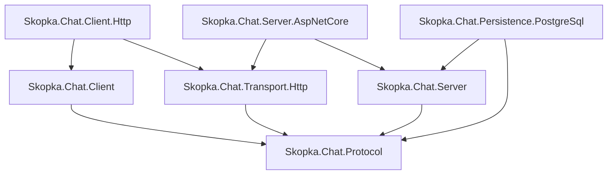

# Development guide

This guide is for human contributors. Coding agents must also follow the repository-root [`AGENTS.md`](../AGENTS.md).

## Prerequisites

- .NET SDK selected by [`global.json`](../global.json) (`10.0.101` with latest-patch roll-forward).
- PowerShell examples below also work with equivalent environment-variable syntax in another shell.
- Docker or a separately provisioned **disposable** PostgreSQL database for persistence gates.

NuGet restore uses only the source declared in [`NuGet.Config`](../NuGet.Config). Dependency versions are centralized in [`Directory.Packages.props`](../Directory.Packages.props); package/repository metadata is centralized in [`Directory.Build.props`](../Directory.Build.props).

## Architecture



The arrows are intentional trust and dependency boundaries. In particular, Protocol is framework-independent, Server never references Client, the shared HTTP contract references Protocol only, and the HTTP client/server adapters never reference one another.

## Build and infrastructure-free tests

From the repository root:

```powershell
dotnet restore Skopka.Chat.sln --configfile NuGet.Config
dotnet format Skopka.Chat.sln --verify-no-changes --no-restore
dotnet build Skopka.Chat.sln --configuration Release --no-restore
dotnet test --solution Skopka.Chat.sln --configuration Release --no-build --no-restore
```

Without `SKOPKA_CHAT_POSTGRES`, database-backed tests are reported as skipped. This is useful for local iteration but is not a release-quality result.

## PostgreSQL gates

Use a database created only for this test run. The tests apply migrations and create/delete test data.

```powershell
$env:SKOPKA_CHAT_POSTGRES = 'Host=localhost;Port=5432;Database=skopka_chat_tests;Username=postgres;Password=...;Pooling=false'
$env:SKOPKA_CHAT_POSTGRES_REQUIRED = 'true'

dotnet test --project tests/Skopka.Chat.Persistence.PostgreSql.Tests --configuration Release --no-build --no-restore
dotnet test --project tests/Skopka.Chat.Http.IntegrationTests --configuration Release --no-build --no-restore
```

The persistence gate covers migrations, encrypted storage, concurrent identical/conflicting submission, at-least-once polling, first-ack semantics, deterministic ordering, and TTL cleanup. The HTTP gate covers the authenticated client/server/E2EE path with both in-memory and migrated PostgreSQL storage.

## Choosing tests while iterating

| Area changed | First focused project(s) | Required broader gate |
| --- | --- | --- |
| Protocol/canonical encoding | `Skopka.Chat.Protocol.Tests` | Client + in-memory integration |
| Client cryptography/receive | `Skopka.Chat.Client.Tests` | Protocol + in-memory integration |
| Server engine | `Skopka.Chat.Server.Tests` | In-memory integration |
| HTTP client/contract | `Skopka.Chat.Client.Http.Tests` | ASP.NET Core tests + HTTP integration |
| ASP.NET Core boundary | `Skopka.Chat.Server.AspNetCore.Tests` | Client HTTP tests + HTTP integration |
| EF model/query/migration | `Skopka.Chat.Persistence.PostgreSql.Tests` | Required PostgreSQL HTTP integration |

All HTTP changes should include negative cases. The deterministic hostile-input corpus currently covers malformed/truncated JSON, media types, duplicate and unknown properties, case mismatches, missing/null values, Base64, identifiers, excessive nesting, trailing content, and every cryptographic envelope byte field.

## Making a change

1. Start from a clean or understood worktree; do not erase unrelated changes.
2. Read the relevant ADR, threat-model section, owning implementation, and existing tests.
3. Add a failing regression test when practical.
4. Implement the smallest change without weakening dependency or trust boundaries.
5. Run focused tests, then the applicable broader gates.
6. Update README, compatibility, threat/limitation docs, and ADRs when behavior or assumptions change.
7. Review `git diff --check`, the complete diff, and `git status --short`.

For schema changes, generate a new EF migration. Existing migrations are append-only release history. For protocol changes, never reuse v1 semantics: introduce a new version and preserve explicit compatibility.

## Packaging and release verification

The solution produces seven NuGet packages in `artifacts/packages`:

```powershell
dotnet pack Skopka.Chat.sln --configuration Release --no-build --no-restore --property:ContinuousIntegrationBuild=true
```

For a committed release, run `pack` after the release commit. MSBuild may otherwise retain a package created before the commit, leaving stale `<repository commit>` metadata. Recreate the versioned packages and inspect a `.nuspec`, for example:

```powershell
tar -xOf artifacts/packages/Skopka.Chat.Transport.Http.0.6.0.nupkg Skopka.Chat.Transport.Http.nuspec
```

The version in the filename is illustrative; use the value from `Directory.Build.props`. Package creation does not imply publication. CI uploads `.nupkg` files only as short-lived workflow artifacts.

## Security review prompts

Before opening a change for review, ask:

- Can plaintext, private keys, access tokens, attacker-controlled JSON, or remote error bodies reach logs or exceptions?
- Is validation performed before persistence, expensive parsing, or cryptographic work?
- Does the change alter canonical bytes, identity binding, retry/idempotency, acknowledgement, ordering, retention, or revocation semantics?
- Are request/response and decoded-field sizes bounded?
- Does a concurrency test need independent `DbContext` instances?
- Does documentation still state the v1 security ceiling and host responsibilities accurately?

The current guarantees and known gaps are documented in [`threat-model.md`](threat-model.md), [`security-self-review.md`](security-self-review.md), and [`mvp-limitations.md`](mvp-limitations.md).
