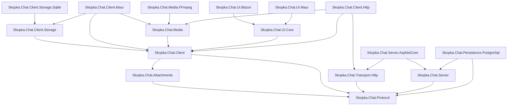

# Development guide

This guide is for human contributors. Coding agents must also follow the repository-root [`AGENTS.md`](../AGENTS.md).

## Prerequisites

- .NET SDK selected by [`global.json`](../global.json) (`10.0.101` with latest-patch roll-forward).
- PowerShell examples below also work with equivalent environment-variable syntax in another shell.
- Docker or a separately provisioned **disposable** PostgreSQL database for persistence gates.
- Optional host-maintained FFmpeg executable and a private working directory when testing `Skopka.Chat.Media.FFmpeg` against real media.
- AFL++ on Linux for coverage-guided fuzzing; corpus replay itself is cross-platform.
- .NET MAUI workloads on Windows for Android/Windows gates and on macOS for iOS/Mac Catalyst gates.

NuGet restore uses only the source declared in [`NuGet.Config`](../NuGet.Config). Dependency versions are centralized in [`Directory.Packages.props`](../Directory.Packages.props); package/repository metadata is centralized in [`Directory.Build.props`](../Directory.Build.props).

## Architecture



The arrows are intentional trust and dependency boundaries. In particular, Protocol is framework-independent, Server never references Client, the shared HTTP contract references Protocol only, and the HTTP client/server adapters never reference one another. Client.Storage depends only on Client; its optional SQLite adapter does not pull server persistence into the application. Media prepares plaintext only on the client before existing attachment encryption; the optional FFmpeg adapter depends on Media, not Server or storage. UI.Core references Client only; Blazor and MAUI add optional UI frameworks without pulling Server or Persistence into the client. Client.Maui contains endpoint adapters only and never becomes a dependency of Client/Storage/Media.

## Build and infrastructure-free tests

From the repository root:

```powershell
dotnet restore Skopka.Chat.sln --configfile NuGet.Config
dotnet format Skopka.Chat.sln --verify-no-changes --no-restore
dotnet build Skopka.Chat.sln --configuration Release --no-restore
dotnet test --solution Skopka.Chat.sln --configuration Release --no-build --no-restore
```

Without `SKOPKA_CHAT_POSTGRES` or `SKOPKA_CHAT_POSTGRES_TESTCONTAINERS=true`, database-backed tests are reported as skipped. This is useful for local iteration but is not a release-quality result.

## PostgreSQL gates

With Docker running, prefer the pinned Testcontainers fixture. Each test assembly starts its own PostgreSQL 18 container on a random host port and disposes it after the assembly completes:

```powershell
$env:SKOPKA_CHAT_POSTGRES_TESTCONTAINERS = 'true'
$env:SKOPKA_CHAT_POSTGRES_REQUIRED = 'true'

dotnet test --project tests/Skopka.Chat.Persistence.PostgreSql.Tests --configuration Release --no-build --no-restore
dotnet test --project tests/Skopka.Chat.Attachments.Tests --configuration Release --no-build --no-restore
dotnet test --project tests/Skopka.Chat.Http.IntegrationTests --configuration Release --no-build --no-restore
```

To test an external PostgreSQL deployment instead, set `SKOPKA_CHAT_POSTGRES` to an explicitly disposable database; it takes precedence over the Testcontainers flag. The tests apply migrations and create/delete rows, so never use a shared or production database. `SKOPKA_CHAT_POSTGRES_REQUIRED=true` makes a missing test database or unavailable requested container fail rather than skip.

The persistence gate covers migrations, encrypted storage, concurrent identical/conflicting submission, at-least-once polling, first-ack semantics, deterministic ordering, and TTL cleanup. The attachment gate covers its isolated migration, ciphertext-only model, bytea integrity and immutable retry/conflict behavior. The HTTP gate covers the authenticated client/server/E2EE envelope path with both in-memory and migrated PostgreSQL storage.

## Choosing tests while iterating

| Area changed | First focused project(s) | Required broader gate |
| --- | --- | --- |
| Protocol/canonical encoding | `Skopka.Chat.Protocol.Tests` | Client + in-memory integration |
| Client cryptography/receive | `Skopka.Chat.Client.Tests` | Protocol + in-memory integration |
| Client durable history/sync | `Skopka.Chat.Client.Storage.Tests` | Infrastructure-free solution suite + package consumer |
| Attachment crypto/storage | `Skopka.Chat.Client.Tests` + `Skopka.Chat.Attachments.Tests` | Both HTTP projects + required attachment PostgreSQL gate |
| Media preparation | `Skopka.Chat.Media.Tests` | Client + Client.Http + infrastructure-free solution suite |
| UI state/components | `Skopka.Chat.UI.Core.Tests` + `Skopka.Chat.UI.Blazor.Tests` | Infrastructure-free solution suite + package consumer |
| MAUI client/lifecycle/files | `Skopka.Chat.Client.Maui.Tests` | Android + Windows and iOS + Mac Catalyst matrix |
| MAUI control/XAML | `Skopka.Chat.UI.Maui.Tests` | Platform sample builds + trimming smoke + MAUI package consumer |
| Server engine | `Skopka.Chat.Server.Tests` | In-memory integration |
| HTTP client/contract | `Skopka.Chat.Client.Http.Tests` | ASP.NET Core tests + HTTP integration |
| ASP.NET Core boundary | `Skopka.Chat.Server.AspNetCore.Tests` | Client HTTP tests + HTTP integration |
| EF model/query/migration | `Skopka.Chat.Persistence.PostgreSql.Tests` | Required PostgreSQL HTTP integration |
| Shared HTTP JSON contracts | `Skopka.Chat.FuzzTests -- --replay .../corpus` | Both HTTP projects + AFL++ smoke |

All HTTP changes should include negative cases. The deterministic hostile-input corpus currently covers malformed/truncated JSON, media types, duplicate and unknown properties, case mismatches, missing/null values, Base64, identifiers, excessive nesting, trailing content, and every cryptographic envelope byte field.

The Media test project normally uses a fake process runner so CI does not silently depend on one native build. To certify a host-installed FFmpeg and adjacent `ffprobe`, run its synthetic photo/video conformance test explicitly:

```powershell
$env:SKOPKA_CHAT_FFMPEG = (Get-Command ffmpeg).Source
$env:SKOPKA_CHAT_FFMPEG_REQUIRED = 'true'
dotnet test --project tests/Skopka.Chat.Media.Tests --configuration Release --no-restore
```

The test checks real JPEG/H.264/AAC output, dimensions, pixel formats, metadata removal, MP4 fast-start ordering and plaintext work-directory cleanup. It generates synthetic inputs and does not read user media.

## MAUI platform gates

MAUI projects are listed in the solution for discovery but excluded from the default solution build configuration. The core Linux gate therefore remains independent of mobile workloads. Run the platform projects explicitly:

MAUI restore is configuration- and runtime-dependent: use `-p:Configuration=Release` for a separate release restore. Platform sample builds restore their selected framework/runtime graph automatically; do not pass a global `TargetFramework` to restore, because that overrides the framework of core project references. The Windows package-consumer gate downloads the core packages from the same CI run before consuming the two MAUI packages.

```powershell
dotnet workload restore samples/Skopka.Chat.Maui.Sample/Skopka.Chat.Maui.Sample.csproj
dotnet test --project tests/Skopka.Chat.Client.Maui.Tests/Skopka.Chat.Client.Maui.Tests.csproj --configuration Release
dotnet test --project tests/Skopka.Chat.UI.Maui.Tests/Skopka.Chat.UI.Maui.Tests.csproj --configuration Release
dotnet build samples/Skopka.Chat.Maui.Sample/Skopka.Chat.Maui.Sample.csproj --framework net10.0-android --configuration Release
```

Windows CI also builds the unpackaged Windows target and creates both MAUI NuGet packages, then inspects their Android/iOS/Mac Catalyst/Windows assets and restores `tests/Skopka.Chat.Maui.PackageConsumer` from those local files. macOS CI builds iOS simulator and Mac Catalyst targets and performs a trimmed Mac Catalyst publish smoke. A build on only one desktop OS is not the coordinated MAUI release gate.

Dependency audit follows the same platform boundary. Linux audits the thirty-two restored core projects through `Skopka.Chat.Core.slnf`; Windows separately audits the two MAUI packages, their two test projects and the MAUI sample after workload restore. Keep the filter synchronized with non-MAUI solution projects so adding a platform package cannot make Linux load an unsupported workload or silently remove that package from the appropriate audit.

## Coverage-guided JSON fuzzing

The `Skopka.Chat.FuzzTests` executable accepts bounded byte streams and selects one of eleven targets: ten shared HTTP contracts (including personal-conversation and device-directory pages) or the authenticated versioned-content decoder (v1 text/reaction, v2 attachments and v3 edits). Successful HTTP values and typed content are round-tripped. `JsonException`, `ProtocolValidationException` and `ChatContentFormatException` are expected rejection outcomes; other exceptions fail the run.

Replay committed seeds and minimized regressions on any platform:

```powershell
dotnet run --project tests/Skopka.Chat.FuzzTests --configuration Release --no-build -- --replay tests/Skopka.Chat.FuzzTests/corpus
```

Run a coverage-guided session on Linux after installing AFL++:

```bash
bash eng/run-json-fuzz-smoke.sh 60 artifacts/fuzz-local
```

The second argument is a new output directory; the script refuses to overwrite an existing path. It builds and instruments isolated HTTP-contract and Client DLL copies with the repo-local SharpFuzz tool, so release binaries remain untouched. Minimize any crash input, add it to `tests/Skopka.Chat.FuzzTests/corpus`, add a focused regression test when possible, and only then fix the defect.

## Making a change

1. Start from a clean or understood worktree; do not erase unrelated changes.
2. Read the relevant ADR, threat-model section, owning implementation, and existing tests.
3. Add a failing regression test when practical.
4. Implement the smallest change without weakening dependency or trust boundaries.
5. Run focused tests, then the applicable broader gates.
6. Update README, compatibility, threat/limitation docs, and ADRs when behavior or assumptions change.
7. Review `git diff --check`, the complete diff, and `git status --short`.

For schema changes, generate a new EF migration. Existing migrations are append-only release history. For protocol changes, never reuse v1 semantics: introduce a new version and preserve explicit compatibility.

## Packaging and release verification

The coordinated set contains eighteen NuGet packages and eighteen symbol packages. Linux creates the sixteen framework-independent/core packages; Windows adds `Skopka.Chat.Client.Maui` and `Skopka.Chat.UI.Maui` after building all package target frameworks. CI combines the artifacts and rejects missing or extra versioned files:

```powershell
dotnet pack Skopka.Chat.sln --configuration Release --no-build --no-restore --property:ContinuousIntegrationBuild=true
dotnet pack src/Skopka.Chat.Client.Maui/Skopka.Chat.Client.Maui.csproj --configuration Release --no-build --no-restore
dotnet pack src/Skopka.Chat.UI.Maui/Skopka.Chat.UI.Maui.csproj --configuration Release --no-build --no-restore
```

For a committed release, run `pack` after the release commit. MSBuild may otherwise retain a package created before the commit, leaving stale `<repository commit>` metadata. Recreate the versioned packages and inspect a `.nuspec`, for example:

```powershell
$packageVersion = dotnet msbuild src/Skopka.Chat.Protocol/Skopka.Chat.Protocol.csproj -getProperty:PackageVersion -nologo
tar -xOf "artifacts/packages/Skopka.Chat.Transport.Http.$packageVersion.nupkg" Skopka.Chat.Transport.Http.nuspec
```

Package creation does not imply publication. CI uploads `.nupkg` and `.snupkg` files only as short-lived workflow artifacts. The excluded `tests/Skopka.Chat.PackageConsumer` proves consumption of the sixteen core assemblies; `tests/Skopka.Chat.Maui.PackageConsumer` proves Android consumption of the two platform packages. See [`releasing.md`](releasing.md) for the protected tag workflow.

## Security review prompts

Before opening a change for review, ask:

- Can plaintext, private keys, access tokens, attacker-controlled JSON, or remote error bodies reach logs or exceptions?
- Is validation performed before persistence, expensive parsing, or cryptographic work?
- Does the change alter canonical bytes, identity binding, retry/idempotency, acknowledgement, ordering, retention, or revocation semantics?
- Are request/response and decoded-field sizes bounded?
- Does a concurrency test need independent `DbContext` instances?
- Does documentation still state the v1 security ceiling and host responsibilities accurately?

The current guarantees and known gaps are documented in [`threat-model.md`](threat-model.md), [`security-self-review.md`](security-self-review.md), and [`mvp-limitations.md`](mvp-limitations.md).
