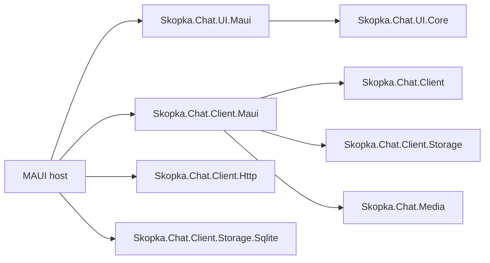

# .NET MAUI integration

`Skopka.Chat.Client.Maui` and `Skopka.Chat.UI.Maui` are optional endpoint packages for Android, iOS, Mac Catalyst and Windows. They do not change protocol-v1 or encrypted-content bytes and never move plaintext processing to the server. The complete, deliberately non-production composition is in [`samples/Skopka.Chat.Maui.Sample`](../samples/Skopka.Chat.Maui.Sample).

## Package boundary



The MAUI packages do not reference Server, ASP.NET Core or PostgreSQL persistence. Authentication/token refresh, navigation, contacts, push notifications, platform entitlements, local retention and protected database placement remain application responsibilities.

### Apple native runtime boundary

The reviewed NSec 26.4.0 / libsodium 1.0.22 dependency set ships `ios-arm64`, `maccatalyst-arm64` and `maccatalyst-x64` native assets, but no `iossimulator-*` asset. iOS support therefore targets physical ARM64 devices; the sample's encrypted client cannot link for an iOS simulator with this dependency set. This follows the [NSec supported-platform matrix](https://nsec.rocks/docs/install). Do not substitute a macOS or device binary for a simulator binary.

The macOS CI gate builds and natively links an unsigned iOS ARM64 device app and builds/trims Mac Catalyst. It does not deploy to a device or certify SecureStorage/Keychain behavior there. Signing, provisioning and physical-device smoke tests remain host responsibilities. Simulator support requires a separately reviewed compatible native dependency change; it is not claimed by this release.

## Client composition

A normal session performs these steps:

1. obtain authenticated `UserId`/`DeviceId`, peer identity and HTTPS endpoint from the host account/session provider;
2. load `DeviceKeyMaterial` from `SecureStorageDeviceKeyStore`, or explicitly create/register a new identity when the record is absent;
3. get-or-create the unique personal conversation and enumerate authorized active recipient devices through `SkopkaChatHttpClient`;
4. create a protected local `SqliteChatEventStore` and `SqliteChatOutboxStore` for that account/device;
5. build `ChatMultiDeviceSender`, `MultiDeviceChatContentSender`, `ChatHistoryPager` and `ChatSyncCoordinator`;
6. call `MauiChatLifecycleCoordinator.StartAsync`, then forward host resume/sleep events;
7. dispose or switch the whole `MauiChatSession` on logout/account change.

`MauiChatSessionManager.SwitchAsync` disposes the prior session before exposing the new one. The lifecycle coordinator serializes restore/poll/outbox work, uses bounded retry with jitter for transient wake failures and does not promise background execution. Mobile operating systems can suspend or terminate the process; production delivery still needs a host-owned push/wake strategy followed by normal authenticated synchronization.

The sender stores the exact recipient-specific ciphertext plan before any network submission. A partial failure or restart retries the same `MessageId`, nonce, ciphertext, tag and signature only for unaccepted recipients. A refreshed directory is used for a new logical send, never to mutate an existing outbox plan. New or changed device keys remain `Unknown`/`Changed` until the host presents verification UI and explicitly records trust.

## Secure storage and local plaintext

`SecureStorageDeviceKeyStore` and `SecureStorageDeviceTrustStore` use an injected `ISecureStorage`. Their records are versioned, bounded and namespaced by account/device. Corrupt or inaccessible records fail with generic storage exceptions; missing key material is never silently replaced because that would look like an unexplained identity-key change.

MAUI SecureStorage is a platform adapter, not a backup protocol. The host must review Android Auto Backup behavior and exclusions, iOS Keychain persistence/entitlements, uninstall/restore/account-switch behavior and device-lock policy for its deployment. A restore can make a protected record unavailable or inconsistent with a freshly installed app; treat that as a recovery flow, not permission to generate a replacement invisibly.

SQLite history contains authenticated decrypted content, including message/caption text and attachment keys. The outbox contains exact encrypted envelopes and delivery metadata. Neither database is encrypted by these packages. Put each account/device database under an app-private protected path, exclude it from unsafe backup/log/crash collection, define retention/deletion, and remove it explicitly on logout only when that is the product policy.

## Native conversation control

`SkopkaChatView` binds to `ChatViewModel` and maintains stable `MauiChatTimelineItem` wrappers keyed by `ChatContentId`. It applies inserts/removals/updates on an injected MAUI dispatcher instead of replacing the collection, so the virtualized `CollectionView` can retain anchors while older pages are prepended. The default view includes text and attachment bubbles, own/remote styling, reply/forward/reaction/edit actions, loading/empty/error state, a composer and 44-device-independent-pixel interaction targets.

Applications can replace `MessageTemplate`, `AttachmentTemplate`, `ComposerTemplate` and `EmptyTemplate`, supply localized `MauiChatStrings`, reaction choices and light/dark resources, or ignore the control and bind directly to UI.Core. Host callbacks own forwarding target selection, attachment picking/sending, authenticated download/decryption and older-page loading. Callback failures become generic UI state; remote bodies, local paths and plaintext are not reflected.

The default attachment card never opens a URI or file automatically. `MauiProtectedFileService` copies a selected file into a generated app-private work path, checks size before and during streaming, and deletes it after the callback. Decrypted downloads use the same bounded temporary-file pattern. The host decides whether and how to preview/share a successfully authenticated result.

XAML uses compiled bindings and source-generated inflation. Keep `x:DataType` on custom templates, avoid runtime-only reflection binding when trimming/NativeAOT matters, and run the repository's Android/Windows/iOS/Mac Catalyst matrix after changing controls or resources. Safe-area and soft-keyboard behavior remain platform/window responsibilities; test composer visibility on actual target OS versions.

## Upgrade from 0.12.x

- Keep every coordinated `Skopka.Chat.*` reference on `0.13.x`; protocol-v1 and encrypted-content v1/v2/v3 bytes need no migration.
- Apply PostgreSQL migration `202609020004_UniquePersonalConversations` before enabling the new directory endpoints. It canonicalizes participant order and creates a unique pair index. Preflight for reversed or duplicate pairs first: the migration deliberately fails instead of guessing how to merge different `ConversationId` values and their envelope histories.
- Existing `IChatEventStore` implementations remain source-compatible. History paging is opt-in through `IPagedChatEventStore`; durable sending is opt-in through `IChatOutboxStore` and `ChatMultiDeviceSender`.
- Existing hosts may retain their `IChatContentSender`. To adopt the built-in fan-out without changing `ChatViewModel`, compose `MultiDeviceChatContentSender` over `ChatMultiDeviceSender` and the local-echo committer.
- Give every authenticated user/device session distinct SQLite event/outbox files and SecureStorage namespaces. Decide explicitly whether logout preserves or deletes plaintext history; the new packages do not perform account recovery, encrypted backup or secure database deletion.

## Local verification

Install the .NET 10 MAUI workload appropriate for the host, then run the platform projects explicitly; they are kept outside the infrastructure-free solution build matrix:

```powershell
dotnet workload restore samples/Skopka.Chat.Maui.Sample/Skopka.Chat.Maui.Sample.csproj
dotnet test --project tests/Skopka.Chat.Client.Maui.Tests/Skopka.Chat.Client.Maui.Tests.csproj -c Release
dotnet test --project tests/Skopka.Chat.UI.Maui.Tests/Skopka.Chat.UI.Maui.Tests.csproj -c Release
dotnet build samples/Skopka.Chat.Maui.Sample/Skopka.Chat.Maui.Sample.csproj -f net10.0-android -c Release
```

Windows additionally builds `net10.0-windows10.0.19041.0`; macOS builds `net10.0-ios` and `net10.0-maccatalyst` and performs the trimming smoke. CI is the canonical four-platform gate. See [ADR 0016](adr/0016-maui-client-orchestration.md), [client storage](client-storage.md), [adaptable UI](ui.md) and the [threat model](threat-model.md).
