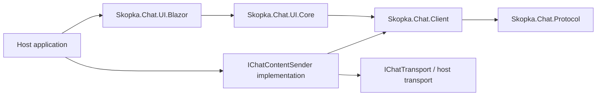

# Adaptable UI

`Skopka.Chat.UI.Core` and `Skopka.Chat.UI.Blazor` are optional client-side packages. They never run on the server and do not change the protocol-v1 envelope. Their timeline projects content-v1 text/reactions, content-v2 attachment manifests and author-validated content-v3 edits already authenticated by Client.

## Package boundary



`ChatViewModel` owns an in-memory `Timeline` containing text and attachment items, a legacy text-only `Messages` view, bounded composer draft, reply/edit target and generic command-failure state. It accepts only `ReceivedChatContent`, so a host should call `ChatReceiver.ReceiveContentAsync` before `Apply`. It does not decrypt envelopes/files, upload ciphertext, enumerate devices, choose a transport, store history or log failures.

The host implements `IChatContentSender`. For one logical event it must:

1. keep the supplied `ChatContentId` stable;
2. enumerate current recipient devices through an authenticated directory;
3. create a distinct `MessageId` and encrypted envelope for each device;
4. submit the envelopes with normal idempotency handling;
5. return `ChatContentSendResult.Success` with a matching authenticated local echo, or `ChatContentSendResult.Failed` for an expected bounded failure.

Unexpected programming failures and caller cancellation may still throw. Do not copy remote response bodies, plaintext or access tokens into exception messages or telemetry.

## Blazor component

Add the two coordinated packages and place the component in a Blazor page:

```razor
@using Skopka.Chat.UI
@using Skopka.Chat.UI.Blazor
@using Skopka.Chat.Client
@using Skopka.Chat.Protocol

<SkopkaChat ViewModel="Chat"
            CssClass="my-chat"
            Strings="RussianStrings"
            ReactionChoices="MyReactions"
            ForwardRequested="ChooseForwardTarget"
            AttachmentSender="SendBrowserAttachmentAsync"
            AttachmentDownloadRequested="DownloadAndDecrypt" />

@code {
    [Parameter, EditorRequired]
    public ChatViewModel Chat { get; set; } = null!;

    private static readonly SkopkaChatStrings RussianStrings = SkopkaChatStrings.Default with
    {
        EmptyConversation = "Сообщений пока нет",
        ComposerPlaceholder = "Напишите сообщение",
        Send = "Отправить",
        Reply = "Ответить",
        Forward = "Переслать",
        Edit = "Изменить",
        Edited = "изменено",
        EditingMessage = "Редактирование сообщения",
        EditingCaption = "Редактирование подписи",
        Save = "Сохранить",
    };

    private static readonly IReadOnlyList<string> MyReactions = ["👍", "🔥", "❤️"];

    private async Task ChooseForwardTarget(ProjectedChatMessage message)
    {
        ConversationId? target = await ShowConversationPickerAsync();
        if (target is not null)
        {
            await Chat.ForwardAsync(message.ContentId, target.Value);
        }
    }
}
```

The default Edit action is visible only for projected items whose authenticated `SenderUserId` equals `ChatViewModel.CurrentUserId`. `BeginEdit` reuses the composer for a text body or attachment caption, while preserving the prior unsent draft/reply state until save or cancel:

```csharp
chat.BeginEdit(ownItem.ContentId);
chat.SetDraftText("corrected text");
bool saved = await chat.TrySendDraftAsync();
```

Saving emits a new `ChatEditContent`; it never mutates the original server row. `IsEdited`/`EditedAt` identify the selected edit in projection. Empty attachment-caption input is encoded as a canonical clear operation. Blank text edits, another user's items, unchanged values and wrong target types are rejected or not sent. See [ADR 0013](adr/0013-encrypted-message-edits.md).

The package uses CSS isolation. A normal Blazor application includes referenced-library isolated styles through its generated application stylesheet. Scope brand overrides with `CssClass` or set custom properties through `Style`:

```css
.my-chat {
    --skopka-chat-background: #101418;
    --skopka-chat-surface: #182028;
    --skopka-chat-own-surface: #153c32;
    --skopka-chat-text: #f7fafc;
    --skopka-chat-muted: #a0aec0;
    --skopka-chat-accent: #52b788;
    --skopka-chat-border: #2d3748;
    --skopka-chat-radius: 1.1rem;
    --skopka-chat-font: Inter, system-ui, sans-serif;
    --skopka-chat-max-width: 64rem;
}
```

The standard composer shows a photo/video picker only when `AttachmentSender` is supplied. Its unchecked default uses media `Auto` mode; the user can select “Send as file” for byte-exact `File` mode. The callback owns browser stream limits and maps the selection to `Skopka.Chat.Media`; see [media.md](media.md) for the prepare → encrypt → upload example. Applications can omit the callback or replace `ComposerTemplate` to provide a different picker and policy.

## Replacement levels

- `MessageTemplate` replaces every message bubble while retaining the standard timeline and composer.
- `AttachmentTemplate` replaces every attachment card; `AttachmentDownloadRequested` delegates authenticated retrieval/decryption to the host.
- `ComposerTemplate` replaces the composer, including the optional media picker, while retaining the timeline.
- `EmptyTemplate` replaces the empty state.
- `SenderLabel` and `TimeFormatter` control identity and timestamp presentation.
- `ReactionChoices`, edit labels/markers in `SkopkaChatStrings`, CSS variables and `AdditionalAttributes` customize the standard components.
- An application can ignore `Skopka.Chat.UI.Blazor` entirely and bind MAUI, Avalonia, native or custom web controls directly to `ChatViewModel`.

Templates receive decrypted managed strings. Razor text expressions HTML-encode by default; using `MarkupString`, raw DOM APIs or third-party renderers makes escaping the host's responsibility.

## Deliberate limits

The components are a conversation surface, not a product shell. They do not provide routing, authentication, contacts, conversation selection, device verification dialogs, protected history, notifications, virtualization, automatic attachment previews or offline synchronization. The default attachment card never embeds remote media; the host retrieves and authenticates it. The default forward action raises a callback so the host can choose a target conversation; it never invents one, and attachment forwarding is not implemented.

Drafts, edit buffers, pre-edit composer state, reply previews and projected messages are plaintext managed strings and cannot be reliably zeroed. Keep component lifetime and browser/server logs bounded, use protected local persistence where needed, review Blazor Server circuit exposure, and never treat E2EE as local-at-rest protection.
